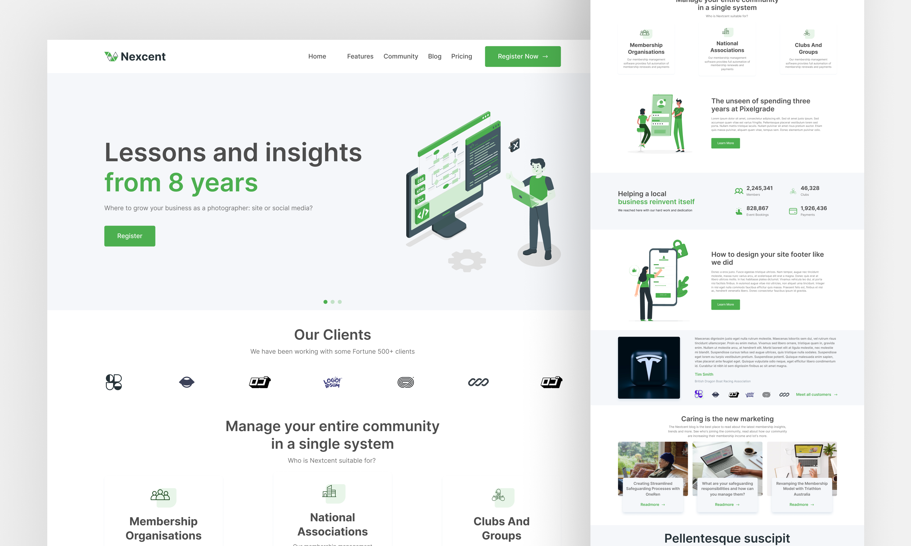

# Nexcent Landing Page

A modern React landing page built with Vite. This project showcases a static marketing page with multiple sections, client logos, feature highlights, animated counters, blog-style cards, and a footer with newsletter signup.

## Demo

- [Live demo](https://mohamedayman011.github.io/landing-page/)

- [Design reference](https://www.figma.com/community/file/1222060007934600841)

## Features

## PreView



- Responsive header with mobile menu toggle
- Hero section with call-to-action
- Client logo carousel
- Service overview with membership use cases
- Animated achievement counters using an odometer-style component
- Community/blog preview cards
- Footer with company links, social icons, and newsletter input
- Image-driven layout using local assets

## Technologies Used

- React 19
- Vite
- JavaScript (ESM)
- React Icons
- CSS modules for component styling
- ESLint

## Installation

```bash
npm install
```

## Usage

Start the development server:

```bash
npm run dev
```

Build for production:

```bash
npm run build
```

Preview the production build:

```bash
npm run preview
```

Run linting:

```bash
npm run lint
```

## Folder Structure

```
landing-page/
├── public/
├── src/
│   ├── App.jsx
│   ├── main.jsx
│   ├── index.css
│   ├── assets/
│   └── components/
│       ├── 1-Header/
│       │   ├── Header.jsx
│       │   └── header.css
│       ├── 2-Hero/
│       │   ├── Hero.jsx
│       │   └── hero.css
│       ├── 3-OurClients/
│       │   ├── OurClients.jsx
│       │   └── ourClients.css
│       ├── 3-Service/
│       │   ├── Service.jsx
│       │   └── service.css
│       ├── 4-Customer/
│       │   ├── Customer.jsx
│       │   └── customer.css
│       ├── 5-Community/
│       │   ├── Community.jsx
│       │   └── community.css
│       ├── 6-Footer/
│       │   ├── Footer.jsx
│       │   └── footer.css
│       └── Odometer/
│           ├── Odometer.jsx
│           └── odometer.css
├── package.json
├── vite.config.js
├── eslint.config.js
└── README.md
```

## Scripts

- `npm run dev` - Start Vite development server
- `npm run build` - Create production build
- `npm run preview` - Preview production build locally
- `npm run lint` - Run ESLint across the project

## Future Improvements

- Add real navigation routing with React Router
- Convert static sections into reusable data-driven components
- Implement accessible form validation and newsletter integration
- Add mobile-first responsive enhancements
- Optimize asset loading and image performance
- Add unit and integration tests

## Contributing

1. Fork the repository
2. Create a feature branch
3. Commit your changes
4. Open a pull request
